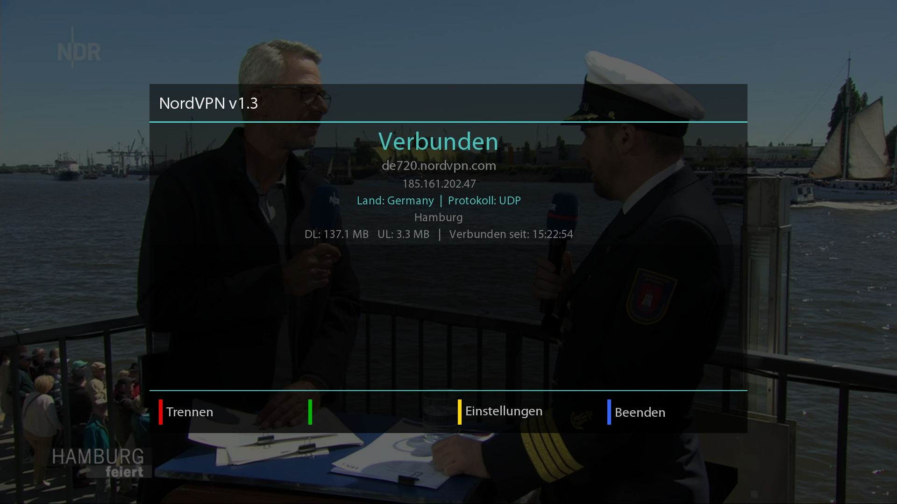
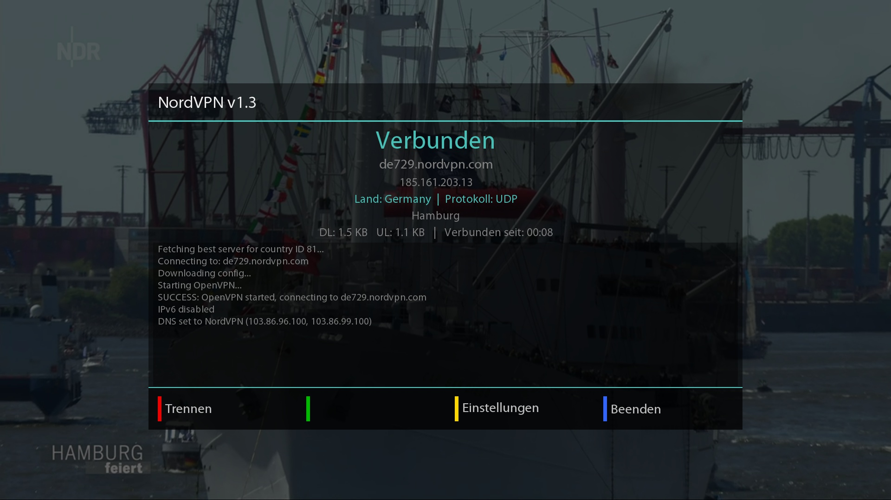
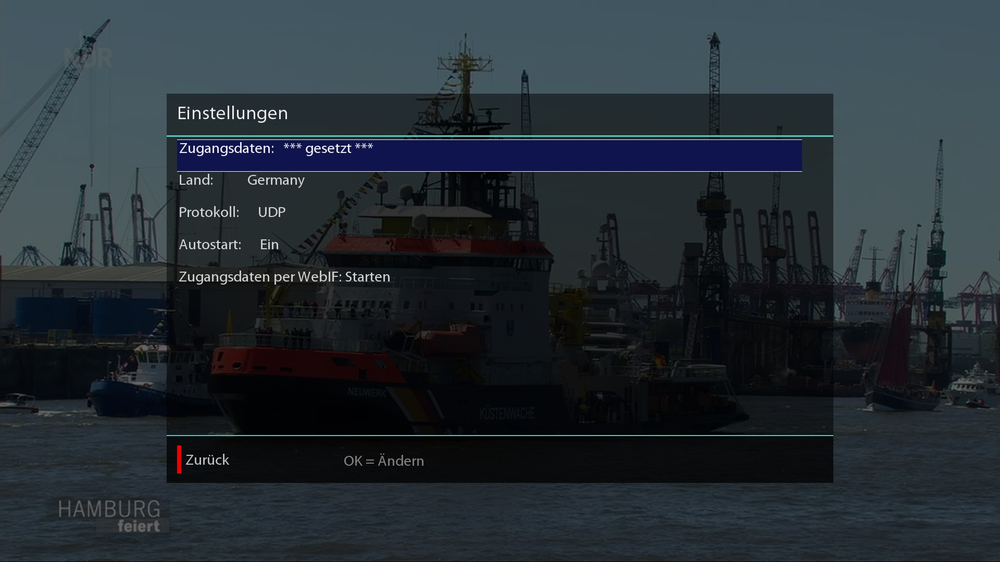
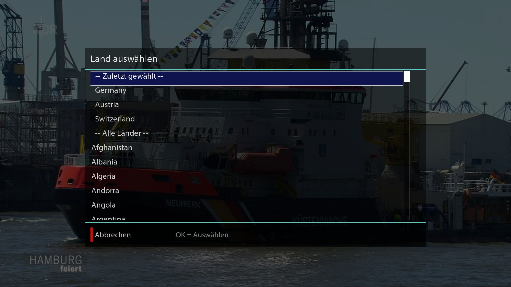
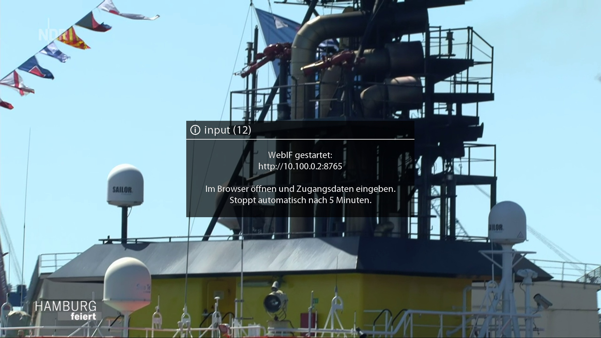
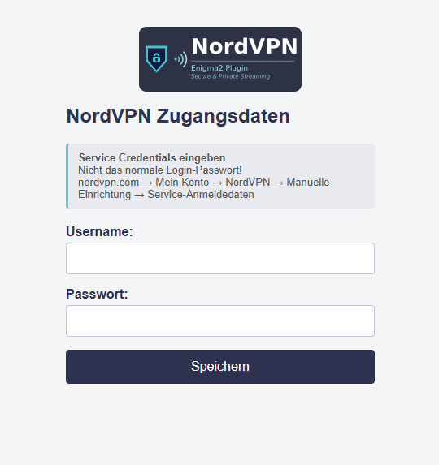

# NordVPN Plugin für Enigma2 (VU+ VTI)

OpenVPN-basierter NordVPN-Client für Enigma2-Receiver mit VTI-Image.

Entwickelt und getestet auf einer **VU+ Uno 4K SE** mit VTI 15.0.04, Python 2.7.9 und OpenVPN 2.3.6.

Dieses Projekt steht unter der [GNU General Public License v2.0](LICENSE).

---

## Screenshots

<table>
  <tr>
    <td></td>
    <td></td>
  </tr>
  <tr>
    <td></td>
    <td></td>
  </tr>
  <tr>
    <td></td>
    <td></td>
  </tr>
</table>

---

## Funktionen

- Verbindung zum besten verfügbaren NordVPN-Server im gewählten Land
- Automatische Serverwahl über die offizielle NordVPN-API
- **Automatisches Überspringen kaputter Server** – ist ein von der API empfohlener Server nicht erreichbar oder lehnt die Zugangsdaten ab, probiert das Plugin selbstständig bis zu 10 weitere Kandidaten, statt mit einer irreführenden Fehlermeldung aufzugeben
- Unterstützung für **UDP** und **TCP**
- **P2P-Server-Typ** wählbar
- **DNS-Leak-Schutz** – NordVPN-DNS wird beim Verbinden gesetzt und beim Trennen wiederhergestellt; DNS-Server wählbar: NordVPN (Standard), Google (8.8.8.8) oder Cloudflare (1.1.1.1)
- **IPv6-Leak-Schutz** – IPv6 wird für die Dauer der VPN-Verbindung deaktiviert
- **Mediathek-Fix** – behebt Verbindungsfehler bei ZDF, 3sat, ZDFinfo, ZDFneo, Phoenix und RBB durch Akamai-CDN-Routing bei aktiver NordVPN-Verbindung
- **Watchdog-Daemon** – erkennt abgestürzte Verbindungen und reconnectet automatisch (in den ersten 2 Minuten nach einem Verbindungsversuch alle 10 Sekunden, danach alle 60 Sekunden); merkt sich dabei kaputte Server und meidet sie bei künftigen automatischen Reconnects
- **Auto-Reconnect bei Einstellungsänderungen** – Land, Protokoll, Server-Typ, DNS oder Mediathek-Fix ändern verbindet automatisch neu, ohne den Einstellungs-Screen zu verlassen
- **OSD-Benachrichtigungen** bei Verbindungsauf- und -abbau (nur wenn das Plugin geschlossen ist; bei manuellem Trennen erscheint keine Meldung)
- **Nächster Server** – bei bestehender Verbindung wechselt die Blaue Taste direkt zum nächstbesten Server der NordVPN-API (aktueller und bereits bekannte kaputte Server werden übersprungen)
- **WebIF** – Zugangsdaten per Browser eingeben, ohne die Fernbedienung zu nutzen
- **Autostart** beim Hochfahren der Box (optional)
- **Zuletzt gewählte Länder** werden oben in der Länderliste angezeigt

---

## Voraussetzungen

- VU+ Receiver mit **VTI-Image**
- Ein NordVPN-Konto mit **Service Credentials**

> **Wichtig:** Es werden nicht die normalen Login-Daten benötigt, sondern die manuellen Service Credentials.  
> Diese findest du unter: [nordvpn.com](https://nordvpn.com) → Mein Konto → NordVPN → Manuelle Einrichtung → **Service-Anmeldedaten**

---

## Installation

Die aktuelle `.ipk`-Datei von der [Releases-Seite](../../releases/latest) herunterladen und per SSH auf die Box übertragen:

```sh
cat enigma2-plugin-extensions-nordvpn_*_all.ipk | ssh root@<BOX-IP> "cat > /tmp/nordvpn.ipk"
ssh root@<BOX-IP> "opkg install /tmp/nordvpn.ipk"
```

Das Plugin installiert sich vollständig – Berechtigungen werden automatisch gesetzt, der Watchdog-Daemon wird beim nächsten Verbinden gestartet.

Das Plugin erscheint nach einem Neustart von Enigma2 im Menü unter **Plugins → NordVPN**.

### Installierte Dateien

| Pfad | Beschreibung |
|------|--------------|
| `/usr/lib/enigma2/python/Plugins/Extensions/NordVPN/` | Plugin-Dateien |
| `/usr/sbin/nordvpn-connect` | Verbindungsaufbau |
| `/usr/sbin/nordvpn-disconnect` | Verbindungstrennung |
| `/usr/sbin/nordvpn-fetch-countries` | Länderliste von der NordVPN-API laden |
| `/usr/sbin/nordvpn-watchdog` | Hintergrunddaemon |
| `/usr/sbin/nordvpn-webif` | Weboberfläche zur Credential-Eingabe |

---

## Einrichtung

Das Plugin öffnen: **Menü → Plugins → NordVPN**

Dann **Gelb → Einstellungen**:

### 1. Zugangsdaten hinterlegen

Es gibt zwei Wege, die Credentials einzugeben:

**Über die Fernbedienung:** Einstellungen → **Zugangsdaten** → OK – Username und Passwort über die OSD-Tastatur eingeben.

**Über den Browser (WebIF):** Einstellungen → **WebIF starten** → OK – auf der Box startet ein temporärer Webserver. Die angezeigte Adresse im Browser öffnen und die Daten dort eingeben. Der Webserver stoppt automatisch nach 5 Minuten oder sobald die Daten gespeichert wurden.

Service Username und Service Passwort eingeben (nicht die normalen Login-Daten – siehe oben).  
Die Credentials werden im Klartext unter `/etc/openvpn/nordvpn_auth.txt` gespeichert (Berechtigungen: 600, nur für root lesbar).

### 2. Land auswählen

Einstellungen → **Land** → OK

Die Länderliste wird live von der NordVPN-API geladen. Zuletzt gewählte Länder erscheinen oben.  
Beim Verbinden wird automatisch der beste verfügbare Server im gewählten Land ausgewählt.

### 3. Protokoll wählen

Einstellungen → **Protokoll** → OK oder Links/Rechts

- **UDP** – Standard, schneller
- **TCP** – stabiler hinter restriktiven Firewalls

### 4. Server-Typ wählen

Einstellungen → **Server-Typ** → OK oder Links/Rechts

- **Standard** – normale NordVPN-Server
- **P2P** – Server mit P2P-Unterstützung

### 5. DNS-Server

Einstellungen → **DNS-Server** → OK oder Links/Rechts

- **NordVPN** – Standard, NordVPN-eigene DNS-Server
- **Google** – 8.8.8.8 / 8.8.4.4
- **Cloudflare** – 1.1.1.1 / 1.0.0.1

### 6. Mediathek-Fix

Einstellungen → **Mediathek-Fix** → OK oder Links/Rechts

Behebt Verbindungsfehler bei ZDF, 3sat, ZDFinfo, ZDFneo, Phoenix und RBB bei aktiver NordVPN-Verbindung. Ursache ist Akamai-CDN-Routing: Der Fix löst den betroffenen Hostnamen vor dem VPN-Aufbau mit dem Heim-DNS auf und trägt die IP temporär in `/etc/hosts` ein. Beim Trennen wird der Eintrag automatisch wieder entfernt.

### 7. Autostart

Einstellungen → **Autostart** → OK oder Links/Rechts


Wenn aktiviert, verbindet das Plugin automatisch beim Starten der Box.

---

## Bedienung

| Taste | Funktion |
|-------|----------|
| Grün | Verbinden |
| Rot | Trennen |
| Gelb | Einstellungen |
| Blau | Nächster Server (nur bei aktiver Verbindung) |
| Exit / Back | Plugin schließen |

Das Hauptfenster zeigt: Verbindungsstatus, aktueller Server, externe IP, Land, Protokoll, Stadt, Session-Traffic (DL/UL) und Verbindungsdauer – alles wird regelmäßig aktualisiert.

---

## Technische Details

### DNS-Leak-Schutz

Beim Verbinden werden die NordVPN-eigenen DNS-Server gesetzt (`103.86.96.100`, `103.86.99.100`) und die ursprüngliche Konfiguration gesichert. Beim Trennen wird sie automatisch wiederhergestellt.

### IPv6-Leak-Schutz

IPv6 wird für die Dauer der VPN-Verbindung systemweit deaktiviert und beim Trennen wiederhergestellt. So kann kein Traffic an der VPN-Verbindung vorbeifließen.

### Watchdog

Der Watchdog-Daemon läuft im Hintergrund und prüft alle 60 Sekunden, ob der OpenVPN-Prozess noch aktiv ist. Ist er abgestürzt, wird automatisch eine neue Verbindung aufgebaut. Der Watchdog erkennt den VPN-Zustand zuverlässig auch nach einem Plugin- oder E2-Neustart.

Beim manuellen Trennen über das Plugin wird der Watchdog beendet – es erfolgt keine automatische Wiederverbindung.

---

## Deinstallation

```sh
# IPK auf die Box kopieren (falls nicht mehr vorhanden, aus dem Release-ZIP)
cat enigma2-plugin-extensions-nordvpn_*_all.ipk | ssh root@<BOX-IP> "cat > /tmp/nordvpn.ipk"

# Paket registrieren und vollständig entfernen
ssh root@<BOX-IP> "opkg install --force-reinstall /tmp/nordvpn.ipk && opkg remove enigma2-plugin-extensions-nordvpn"
```

Das Deinstallations-Skript räumt vollständig auf: Watchdog und OpenVPN werden beendet, alle Konfigurationsdateien und Logdateien werden gelöscht, die **Credentials werden entfernt**.

---

## Für Entwickler

### IPK neu bauen

```sh
python3 tools/build_ipk.py
```

Alle Quelldateien müssen im Projektordner vorhanden sein. Das fertige IPK wird im Projekt-Root abgelegt.

### Hinweise zur Kompatibilität

Das Plugin setzt Python 2.7 und die Enigma2-Python-API (VTI-Image) voraus. Es wurde ausschließlich auf VTI 15 getestet. Andere Enigma2-Images oder Python-3-Umgebungen werden nicht unterstützt.
